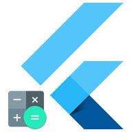
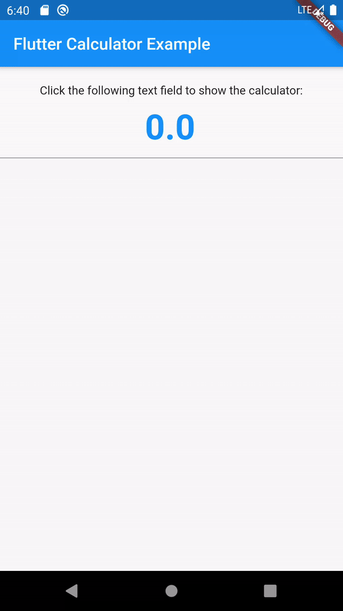

Flutter Calculator Widget
==================================================



A simple, smart and powerful flutter calculator widget.

## Features

- Basic arithmetic: plus, minus, multiply, divide, %, brackets.
- **Real-Time** calculating.
- Prevent to input the invalid symbol.
- **Auto-resize** the formula or result font size to adapt the text box's boundary.
- Supports **undo** and **redo**.
- Supports to relocate and input symbols.
- Can be used as an embedded widget or a dialog.
- [**WIP**] Supports to specify the result's precision.

## Getting Started

- Add dependency to your `pubspec.yaml`:

```yaml
dependencies:
  flutter_calculator:
    git:
      url: git://github.com/flytreeleft/flutter_calculator.git
      # Use the developing version
      ref: master
      # or use the release version
      #ref: v0.1.0
```

- Import package `import 'package:flutter_calculator/flutter_calculator.dart';` and call `await showCalculator(context: context);` in your code:

```dart
import 'package:flutter/material.dart';

import 'package:flutter_calculator/flutter_calculator.dart';

void main() => runApp(FlutterCalculatorExample());

class FlutterCalculatorExample extends StatelessWidget {
  @override
  Widget build(BuildContext context) {
    return MaterialApp(
      // ...
      home: const HomePage(title: 'Flutter Calculator Example'),
    );
  }
}

class HomePage extends StatefulWidget {
  @override
  _HomePageState createState() => _HomePageState();
}

class _HomePageState extends State<HomePage> {
  final TextEditingController _textController = TextEditingController(text: '0.00');

  @override
  void dispose() {
    this._textController.dispose();
    super.dispose();
  }

  @override
  Widget build(BuildContext context) {
    return Scaffold(
      // ...
      body: TextField(
        showCursor: false,
        readOnly: true,
        controller: this._textController,
        onTap: () => this._showCalculatorDialog(context),
      ),
    );
  }

  void _showCalculatorDialog(BuildContext context) async {
    final result = await showCalculator(context: this.context) ?? 0.00;

    this._textController.value = this._textController.value.copyWith(
          text: result.toStringAsFixed(2),
        );
  }
}
```

## Examples

- [flutter_calculator_example](./example/)



<!--
[Making animated GIFs of Flutter apps](https://github.com/flutter/flutter/wiki/Making-animated-GIFs-of-Flutter-apps):
- Launch app in release mode: `flutter run --release`
- Record video: `adb shell screenrecord /sdcard/recording.mp4`
- Interact with app. Terminate the recording with `CTRL+c`
- Pull the recording to local: `adb pull /sdcard/recording.mp4 ~/Downloads/`
- Go to http://ezgif.com/video-to-gif and convert the recording to GIF
-->

## License

[Apache License 2.0](https://www.apache.org/licenses/LICENSE-2.0)

## Thanks

- [kenreilly/flutter-calculator-demo](https://github.com/kenreilly/flutter-calculator-demo): Example project - how to build a simple calculator in Flutter.
- [leisim/auto_size_text](https://github.com/leisim/auto_size_text): Flutter widget that automatically resizes text to fit perfectly within its bounds.

## Reference

- [Building a Calculator App in Flutter](https://itnext.io/building-a-calculator-app-in-flutter-824254704fe6)
- [Making animated GIFs of Flutter apps](https://github.com/flutter/flutter/wiki/Making-animated-GIFs-of-Flutter-apps)
